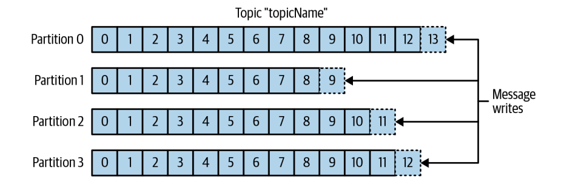
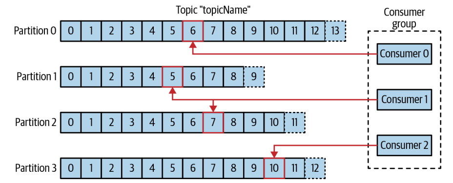

## 카프카 핵심 가이드

#### 발행/구독 메시지 전달 패턴
전송자가 데이터를 보낼 때 직접 수신자로 보내지 않음

전송자는 어떤 형태로든 메시지를 분류해서 보내고, 수신자는 분류된 메시지를 구독

이때, 메시지를 전달받고 중계하는 중간지점 역할 → `브로커(Broker)`

⬇

<figure class="half">  
    </a>  
    </a>  
</figure>
 
 

#### 카프카 데이터의 기본단위: 메시지 (message)
메시지는 키(key)라고 불리는 메타데이터를 포함할 수 있음

키(key) : 메시지를 저장할 파티션을 결정하기 위해 사용

→ 키값에 일정한 해시값을 토픽의 파티션 수로 나눈 나머지값의 파티션에 메시지를 저장

같은 키값을 가진 메시지는 항상 같은 파티션에 저장
 
 

#### 카프카는 메시지를 배치 단위로 저장
why? 네트워크 오버헤드 최소화

지연(latency) 와 처리량(throughput)는 `Trade-off`
 
 

#### 스키마
일반적으로 XML, JSON 등을 사용, 카프카는 Apache Avro를 더 선호

카프카는 일관적인 데이터 형식이 중요
 
 

#### 파티션 & 토픽
파티션 : 토픽 = 1 : N 관계 `(1개의 토픽에 N개의 파티션이 존재)`

단일 파티션에서만 순서가 보장되고, 토픽안의 메시지 전체에 대하여 순서 보장 X

각 파티션을 서로 다른 서버에 저장하여 → `수평적 확장 가능`
 
 

#### 스트림
하나의 토픽에 저장된 데이터로 간주

Pub → Sub 의 하나의 데이터 흐름
 
 

#### 프로듀서 & 컨슈머
<!--  -->
  
프로듀서 : 새로운 메시지를 생성하고, 토픽에 속한 파티션들 사이에 고르게 나눠서 씀

<!--  -->
  
컨슈머: 메시지를 읽음, 메시지의 오프셋(offset)을 기록하여 어느 메시지까지 읽은 지 기록
 
 

#### 컨슈머 그룹
토픽에 저장된 데이터를 읽어오기 위해 협업하는 하나 이상의 컨슈머의 집합

각 파티션이 하나의 컨슈머에 의해서만 읽히도록 함 → `소유권(ownership)`을 가짐
 
 

#### 브로커 & 클러스터
`브로커(Broker)` : 하나의 카프카 서버

프로듀서로부터 메시지를 전달받아 오프셋을 할당한 뒤, 디스크 저장소에 씀 

컨슈머의 파티션 읽기 요청 처리 및 메시지 전송

클러스터 : 여러개의 브로커를 포함

N개의 브로커 중 1개의 브로커가 `클러스터 컨트롤러` 역할

→ 파티션을 브로커에게 할당, 장애 발생 브로커 모니터링 및 관리 역할
 
 

#### 다중 클러스터
장점 

- 데이터 유형별 분리
- 보안 요구사항을 위한 격리
- 재해 복구를 대비한 다중 데이터 센터

미러메이커: 데이터를 다른 클러스터로 복제하는 데 사용
 
 

#### 왜 카프카인가 ?
- 다중 프로듀서 & 컨슈머
    N개의 컨슈머가 상호 간섭없이 어떠한 메시지 스트림도 읽을 수 있음
    
- 디스크 기반 보존
    메시지를 지속성 있게 저장 가능, 데이터 유실 위험 X
    
- 확장성
    카프카 작동 중에도 가용성에 영향 없이 확장 가능
    
- 고성능
- 플랫폼 기능
    API와 라이브러리 형태로 사용이 가능
    

모든 클라이언트에 대해 일관된 인터페이스를 제공하면서, 다양한 인프라 사이에 메시지를 전달함

`프로듀서는 누가 데이터를 사용하는지, 컨슈머는 몇 개인지에 신경쓸 필요 X`

