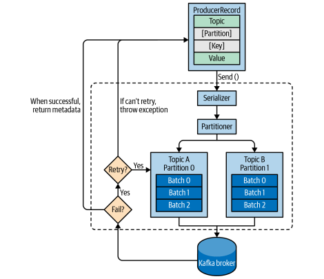
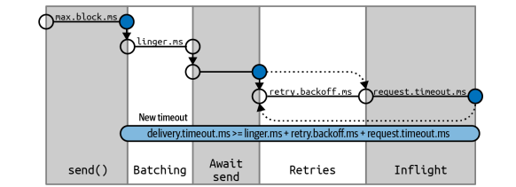
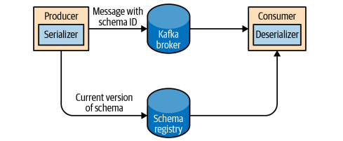

## 카프카 핵심 가이드

### 프로듀서 개요



카프카 프로듀서는 메시지를 브로커로 전송하는 역할을 수행

**메시지 전송 과정:**
1. ProducerRecord 객체 생성
   - 필수 파라미터: topic(토픽명), value(메시지 값)
   - 선택 파라미터: key(메시지 키), partition(파티션 번호), timestamp(타임스탬프)

2. 파티셔닝
   - 파티셔너(Partitioner)가 메시지를 저장할 파티션을 결정
   - 키가 지정된 경우: 키의 `해시값`을 기반으로 파티션 선택
   - 키가 없는 경우: `라운드 로빈` 방식으로 파티션 선택

3. 브로커 전송
   - 프로듀서는 메시지를 브로커로 전송
   - 전송 성공 시 RecordMetadata 반환
     - 토픽명, 파티션 번호, 오프셋 정보 포함

<br>

### 카프카 프로듀서 생성하기

**프로듀서 생성 시 필수 설정값:**

`bootstrap.servers` : 클러스터와 첫 연결을 생성하기 위해 프로듀서가 사용할 브로커의 host:port 목록
- 브로커 중 하나가 작동을 정지할 수 있으므로, 최소 2개 이상을 지정할 것을 권장
- ex) "broker1:9092, broker2:9092, broker3:9092"

`key.serializer` : 레코드의 키 값을 직렬화 하기 위한 시리얼라이저 클래스
- 기본 제공 클래스: StringSerializer, IntegerSerializer, ByteArraySerializer 등
- 커스텀 시리얼라이저 구현 시 Serializer 인터페이스 구현 필요 (권장 X)

`value.serializer` : 레코드의 밸류값을 직렬화 하기 위한 시리얼라이저 클래스
- 키와 동일한 시리얼라이저 사용 가능
- JSON, Avro 등 다양한 포맷 지원

**프로듀서의 메시지 전송 방법:**

1. 파이어 앤 포겟 (Fire and Forget)
   - 메시지를 서버에 전송만 하고 성공, 실패 여부에는 신경 X
   - 데이터 손실 가능성이 높아 프로덕션 환경에서는 권장하지 않음
   - ex) `producer.send(record);`

2. 동기적 전송 (Synchronous send)
   - Future.get()을 사용하여 전송 완료를 기다림
   - 전송 실패 시 예외 발생
   - ex) `producer.send(record).get();`

3. 비동기적 전송 (Asynchronous send)
   - 콜백 함수와 함께 send()를 호출
   - 카프카 브로커로부터 응답 받는 시점에서 자동으로 콜백 함수 호출
   - 성능이 가장 좋고 가장 많이 사용되는 방식
   - ex) `producer.send(record, new DemoProducerCallback());`

**프로듀서 생성 예시:**
```java
Properties props = new Properties();
props.put("bootstrap.servers", "broker1:9092,broker2:9092"); 
props.put("key.serializer", "org.apache.kafka.common.serialization.StringSerializer");
props.put("value.serializer", "org.apache.kafka.common.serialization.StringSerializer");

KafkaProducer<String, String> producer = new KafkaProducer<>(props);
```

<br>

### 카프카로 메시지 전달하기

**동기적 메시지 전송**
- 전송을 요청하는 스레드는 쓰기 요청에 응답하는 동안 블로킹
- 다른 메시지 전송이 불가능한 상태가 됨
- 예외 처리가 명확하고 직관적

```java
try {
    producer.send(record).get(); // Future.get()으로 완료 대기
} catch (Exception e) {
    // 예외 처리
    log.error("메시지 전송 실패", e);
}
```

**KafkaProducer의 에러 유형**
- 재시도 가능한 에러
  - 일시적인 네트워크 문제
  - 설정된 재시도 횟수만큼 자동 재시도
  
- 재시도 불가 에러
  - 즉시 예외 발생

**비동기 메시지 전송**
- 높은 처리량과 성능 제공
- 콜백을 통한 비동기 처리
- 에러 처리와 성공 처리 모두 가능

```java
private class DemoProducerCallback implements Callback {
    @Override
    public void onCompletion(RecordMetadata metadata, Exception e) {
        if (e != null) {
            // 에러 처리
            log.error("메시지 전송 실패", e);
        } else {
            // 성공 처리
            log.info("메시지 전송 성공 - 토픽: {}, 파티션: {}, 오프셋: {}", 
                metadata.topic(), 
                metadata.partition(), 
                metadata.offset());
        }
    }
}

// 메시지 전송 예시
ProducerRecord<String, String> record = 
    new ProducerRecord<>("CustomerCountry", "Biomedical Materials", "USA");
producer.send(record, new DemoProducerCallback());
```

**메시지 전송 시 주의사항**
- 프로듀서 종료 전 반드시 `producer.close()` 호출
- 배치 처리 시 `flush()` 메서드로 강제 전송 가능
- 메시지 순서가 중요한 경우 `max.in.flight.requests.per.connection=1` 설정

<br>

### 프로듀서 설정하기

프로듀서의 주요 설정값들을 카테고리별로 구분하여 설명

**기본 설정**
`client.id` : 프로듀서를 식별하는 고유 ID
- 로그와 메트릭에서 프로듀서를 구분하는데 사용
- ex) "order-service-producer"

`acks` : 메시지 전송 완료 판단 기준
- 0: 전송 즉시 완료로 판단 (데이터 손실 가능성 높음)
- 1: 리더 파티션에 저장되면 완료로 판단 (default)
- all(-1): 모든 ISR에 저장되면 완료로 판단 (가장 안전)

**타임아웃 관련 설정**
메시지 전달 기간:


```java
delivery.timeout.ms >= linger.ms + retry.backoff.ms + request.timeout.ms
```

- `max.block.ms` : send() 호출 시 블로킹 최대 시간 (default 60sec)
  - partitionsFor() 호출, 메타데이터 요청 시 적용

- `delivery.timeout.ms` : 메시지 전송 제한 시간 (default 120sec)
  - 전송 준비 완료 ~ 브로커 응답/포기까지의 시간
  
- `request.timeout.ms` : 브로커 응답 대기 시간 (default 30sec)
  

**재시도 관련 설정**
- `retries` : 재시도 횟수
  - 기본값: 2147483647 (Integer.MAX_VALUE)
  - delivery.timeout.ms와 함께 사용 권장

- `retry.backoff.ms` : 재시도 간격 (default 100ms)

**배치 처리 관련 설정**
- `linger.ms` : 배치 전송 대기 시간 (default 0ms)
  - 처리량 향상을 위해 5-100ms 권장

- `buffer.memory` : 프로듀서 버퍼 크기 (default 32MB)
  - 메모리 부족 시 예외 발생

- `batch.size` : 배치당 최대 크기 (default 16KB)
  - 너무 작으면 처리량 저하, 너무 크면 메모리 사용량 증가

**압축 및 크기 관련 설정**
- `compression.type` : 메시지 압축 방식
  - none: 압축 없음
  - gzip: 높은 압축률, CPU 사용량 많음
  - snappy: 적절한 압축률, CPU 사용량 적음 (권장)
  - lz4: 빠른 압축/해제
  - zstd: 높은 압축률, 적은 CPU 사용량

- `max.request.size` : 요청 최대 크기 (default 1MB)
  - 브로커의 message.max.bytes와 일치해야 함

**네트워크 관련 설정**
- `max.in.flight.requests.per.connection` : 미확인 요청 최대 수 (default 5)
  - 메시지 순서가 중요한 경우 1로 설정

- `receive.buffer.bytes`, `send.buffer.bytes` : TCP 버퍼 크기 (default 32KB)

**멱등성 설정**
- `enable.idempotence` : 멱등성 프로듀서 활성화 (default false)
  - true로 설정 시 중복 메시지 방지
  - retries > 0, acks=all 필요

<br>

### 시리얼라이저

**시리얼라이저 개요**
- 카프카는 바이트 배열로만 데이터를 저장
- 프로듀서: 객체 → 바이트 배열 변환 (직렬화)
- 컨슈머: 바이트 배열 → 객체 변환 (역직렬화)

**권장 직렬화 방식**
커스텀 시리얼라이저 대신 범용 직렬화 라이브러리 사용 권장
1. JSON
   - 장점: 가독성 좋음, 언어 독립적
   - 단점: 스키마 관리 어려움, 용량 큼

2. Apache Avro (권장)
   - 장점: 
     - 스키마 진화 지원
     - 바이너리 포맷으로 용량 작음
     - 스키마 레지스트리와 통합 용이
   - 단점: 설정이 다소 복잡

3. Protocol Buffers
   - 장점: 
     - 스키마 진화 지원
     - 매우 작은 용량
     - 빠른 직렬화/역직렬화
   - 단점: 스키마 관리 필요

**스키마 진화 예시 (Avro)**

Initial schema:
```json
{
    "namespace": "customerManagement.avro",
    "type": "record",
    "name": "Customer",
    "fields": [
        {"name": "id", "type": "int"},
        {"name": "name", "type": "string"},
        {"name": "faxNumber", "type": ["null", "string"], "default": "null"}
    ]
}
```

Updated schema:
```json
{
    "namespace": "customerManagement.avro",
    "type": "record",
    "name": "Customer",
    "fields": [
        {"name": "id", "type": "int"},
        {"name": "name", "type": "string"},
        {"name": "email", "type": ["null", "string"], "default": "null"}
    ]
}
```

스키마 변경 사항:
- faxNumber 필드 제거
- email 필드 추가
- 기존 데이터와의 호환성 유지

**스키마 레지스트리**


스키마 레지스트리 역할:
* 스키마 버전 관리
* 스키마 호환성 검증
* 스키마 ID 관리

작동 방식:
* 프로듀서가 메시지 전송 시 스키마 레지스트리에 스키마 등록
* 레지스트리가 스키마에 고유 ID 할당
* 프로듀서는 메시지와 함께 스키마 ID만 전송
* 컨슈머는 스키마 ID로 레지스트리에서 스키마 조회

<br>

### 파티션

키의 역할

- 메시지에 밸류값과 함께 저장되는 추가 정보
- 여러개의 파티션 중 해당 메시지가 저장될 파티션을 결정

```java
ProducerRecord<String, String> record = 
	new ProducerRecord<>("CustomerCountry", "Laboratory Equipment", "USA"); //topic, key, value
```

```java
ProducerRecord<String, String> record =
	new ProducerRecord<>("CustomerCountry", "USA"); // topic, key=null, value
```

기본 파티셔너 중 키값이 null 인 레코드는 파티션 중 하나에 랜덤하게 저장

메시지 개수의 균형을 맞추기 위해 `라운드 로빈 (Round Robin)` 알고리즘 사용 → 접착성(sticky) 처리

키값이 지정된 상황에서 기본 파티셔너를 사용하면 키값에 해시한 결과를 기준으로 파티션 특정

<br>

### 헤더

**헤더의 개념**
- 메시지의 메타데이터를 저장하는 키-값 쌍
- 메시지 본문(키/밸류)을 수정하지 않고 추가 정보 전달 가능

**주요 사용 사례**
- 메시지 추적 (message-id, timestamp)
- 라우팅 정보 (source, destination)
- 보안 정보 (encryption-type, auth-token)

**헤더 사용 예시**
```java
ProducerRecord<String, String> record =
    new ProducerRecord<>("CustomerCountry", "Precision Products", "France");
record.headers().add("message-id", UUID.randomUUID().toString().getBytes(StandardCharsets.UTF_8));
record.headers().add("timestamp", String.valueOf(System.currentTimeMillis()).getBytes(StandardCharsets.UTF_8));
```

<br>

### 인터셉터

카프카 클라이언트 코드를 수정하지 않고 메시지 처리 과정을 수정할 때 사용

**인터셉터 구현**
```java
public class CustomProducerInterceptor implements ProducerInterceptor<String, String> {
    @Override
    public ProducerRecord<String, String> onSend(ProducerRecord<String, String> record) {
        // 메시지 전송 전 처리
        return record;
    }

    @Override
    public void onAcknowledgement(RecordMetadata metadata, Exception exception) {
        // 브로커 응답 처리
    }

    @Override
    public void close() {
        // 리소스 정리
    }
}
```

**인터셉터 등록**
```java
props.put(ProducerConfig.INTERCEPTOR_CLASSES_CONFIG, 
    "com.example.CustomProducerInterceptor");
```

<br>

### 쿼터, 스로틀링

**쿼터(Quota)**
- 클라이언트의 리소스 사용량을 제한하는 메커니즘
- 클라이언트 ID, 사용자, IP 기반으로 설정 가능

**쿼터 타입**
1. 쓰기 쿼터 (produce quota)
   - 프로듀서의 초당 쓰기 바이트 수 제한

2. 읽기 쿼터 (consume quota)
   - 컨슈머의 초당 읽기 바이트 수 제한

3. 요청 쿼터 (request quota)
   - 클라이언트의 초당 요청 처리 시간 제한


**스로틀링(Throttling)**
- 쿼터 초과 시 브로커가 자동으로 적용하는 제한
- 클라이언트의 요청 처리 속도를 조절하여 쿼터 준수
- 스로틀링 시간은 쿼터 초과량에 비례하여 증가

<br>
<br>
<br>
<br>
<br>