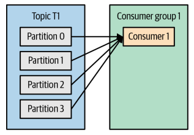
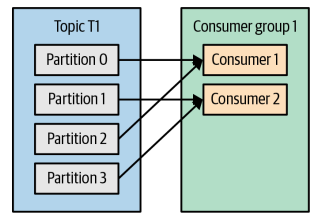
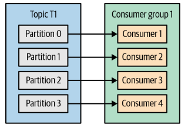
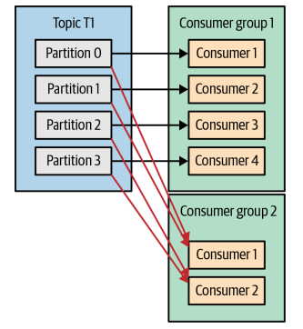
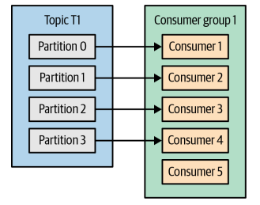
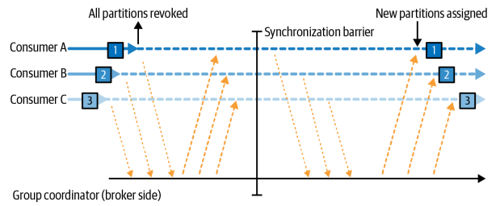
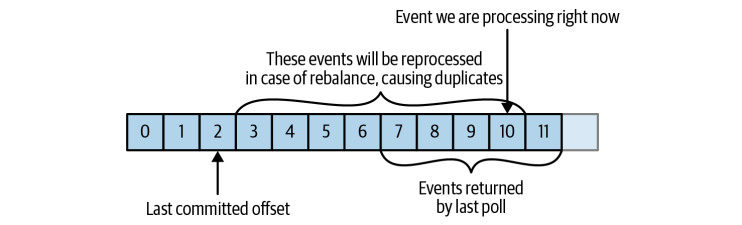
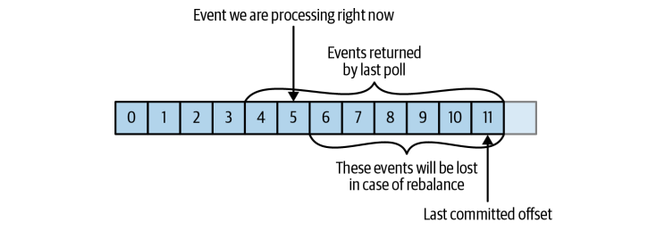

## 카프카 핵심 가이드

### 카프카 컨슈머: 개념

**컨슈머와 컨슈머 그룹**
<div style="display: flex; justify-content: space-between;">
    
    
    
</div>

- 컨슈머는 반드시 컨슈머 그룹에 속해야 함

- 동일 그룹 내 컨슈머들은 서로 다른 파티션의 메시지를 소비

 

- 파티션 수 > 컨슈머 수: 일부 컨슈머가 여러 파티션 처리



- 파티션 수 < 컨슈머 수: 일부 컨슈머는 유휴 상태


**컨슈머 그룹 특징**
- 각 애플리케이션은 고유한 컨슈머 그룹 필요
- 동일 토픽의 메시지를 여러 애플리케이션이 독립적으로 처리 가능
- 파티션과 컨슈머는 1:N 관계 (한 파티션은 하나의 컨슈머만 처리)

**리밸런싱 전략**
1. 조급한 리밸런싱 (Eager Rebalance)

   

   - 모든 컨슈머가 작업 중단
   - 전체 파티션 재할당
   - 처리 중단 시간 발생

<br>

2. 협력적 리밸런싱 (Cooperative Rebalance)

    

   - 필요한 파티션만 재할당
   - 다른 컨슈머는 작업 계속
   - 처리 중단 최소화

**컨슈머 생존 관리**
- `하트비트`로 컨슈머 상태 확인
- `session.timeout.ms` 설정으로 타임아웃 관리
- 정적 그룹 멤버십으로 안정적인 파티션 할당 가능

<br>

### 카프카 컨슈머 생성

**필수 설정**
- `bootstrap.servers`: 카프카 브로커 연결 정보
- `group.id`: 컨슈머 그룹 식별자
- `key.deserializer`: 메시지 키 역직렬화 클래스
- `value.deserializer`: 메시지 값 역직렬화 클래스

**컨슈머 생성 예시**
```java
Properties props = new Properties();
props.put("bootstrap.servers", "broker1:9092,broker2:9092");
props.put("group.id", "CountryCounter");
props.put("key.deserializer", "org.apache.kafka.common.serialization.StringDeserializer");
props.put("value.deserializer", "org.apache.kafka.common.serialization.StringDeserializer");

KafkaConsumer<String, String> consumer = new KafkaConsumer<>(props);
```

**특징**
- 프로듀서와 달리 반드시 `group.id` 설정 필요
- 역직렬화 클래스는 프로듀서의 직렬화 클래스와 일치해야 함
- 하나의 스레드에서 하나의 컨슈머만 사용 가능

<br>

### 토픽 구독하기

**구독 방식**
1. 단일 토픽 구독
```java
consumer.subscribe(Collections.singletonList("customerCountries"));
```

2. 다중 토픽 구독
```java
consumer.subscribe(Arrays.asList("topic1", "topic2", "topic3"));
```

3. 정규식 패턴 구독
```java
consumer.subscribe(Pattern.compile("test.*")); // test로 시작하는 모든 토픽, 정규식 패턴
```

**특징**
- 구독 후 poll() 호출 시 해당 토픽의 메시지 수신 가능
- 정규식 패턴은 동적으로 생성되는 토픽 구독에 유용
- 구독 중인 토픽이 삭제되면 자동으로 구독 해제

<br>

### 폴링 루프

**기본 폴링 구조**
```java
Duration timeout = Duration.ofMillis(100);

while (true) {
	ConsumerRecords<String, String> records = consumer.poll(timeout);
	for (ConsumerRecord<String, String> record : records) {
		// 메시지 처리 로직
		processRecord(record);
	}
}
```

**폴링 특징**
- `poll()`: 메시지를 가져오는 기본 메서드
- `timeout`: 메시지가 없을 때 대기 시간
- `max.poll.interval.ms` 초과 시 컨슈머 그룹에서 제외

**스레드 안전성**
- 하나의 스레드에서 하나의 컨슈머만 사용
- 동일 그룹 내 여러 컨슈머 생성 불가
- 다중 스레드에서 동일 컨슈머 공유 불가

<br>

### 컨슈머 설정하기

**데이터 가져오기 관련 설정**
- `fetch.min.bytes`: 최소 데이터 크기 (default 1byte)
- `fetch.max.wait.ms`: 데이터 대기 시간 (default 500ms)
- `max.partition.fetch.bytes`: 파티션당 최대 데이터 크기 (default 1MB)
- `max.poll.records`: 한 번에 가져올 최대 레코드 수

**컨슈머 생존 관련 설정**
- `session.timeout.ms`: 컨슈머 생존 판단 시간 (default 10sec)
- `heartbeat.interval.ms`: 하트비트 전송 간격 (default 3sec)
- `max.poll.interval.ms`: 폴링 최대 간격 (defaul: 5min)

**오프셋 관련 설정**
- `auto.offset.reset`: 오프셋 초기화 정책
  - latest: 가장 최근 메시지부터 (default)
  - earliest: 처음부터 모든 메시지
  - none: 예외 발생
- `enable.auto.commit`: 자동 커밋 여부 (default true)

**파티션 할당 전략**
- `partition.assignment.strategy`:
  - Range: 토픽별 연속된 파티션 그룹 할당
  - RoundRobin: 모든 파티션을 순차적으로 할당
  - Sticky: 균등 분배 + 리밸런스 최소화
  - Cooperative Sticky: Sticky + 협력적 리밸런스

**기타 중요 설정**
- `client.id`: 클라이언트 식별자
- `group.instance.id`: 정적 그룹 멤버십 설정
- `client.rack`: 가까운 레플리카 선호 설정

<br>

### 오프셋과 커밋

**오프셋의 개념**
- 각 파티션에서 현재 읽은 위치를 나타내는 번호
- `__consumer_offsets` 토픽에 저장
- 마지막 메시지 커밋으로 이전 메시지들의 처리 완료를 암시

**커밋 방식**
1. 자동 커밋
   - `enable.auto.commit=true` (default)
   - `auto.commit.interval.ms` 간격으로 자동 커밋 (default 5sec)
   - 장점: 구현이 간단
   - 단점: 메시지 중복/유실 가능성 존재

<br>

2. 수동 커밋
   - 동기식 커밋 `commitSync()`
     ```java
     try {
         consumer.commitSync();
     } catch (CommitFailedException e) {
         log.error("commit failed", e);
     }
     ```
     - 장점: 커밋 실패 시 즉시 확인 가능
     - 단점: 브로커 응답 대기로 인한 성능 저하

    <br>

   - 비동기식 커밋 `commitAsync()`
     ```java
     consumer.commitAsync((offsets, e) -> {
         if (e != null) log.error("Commit failed", e);
     });
     ```
     - 장점: 높은 처리량
     - 단점: 커밋 실패 시 재시도 불가

**주의사항**



- 오프셋 커밋 < 처리 완료: 메시지 중복 처리



- 오프셋 커밋 > 처리 완료: 메시지 유실
- 리밸런싱 시 정확한 오프셋 커밋이 중요

<br>

### 리밸런스 리스너

**리밸런스 리스너의 역할**
- 파티션 재할당 시 정리 작업 수행
- 오프셋 커밋 및 상태 저장
- 리밸런스 이벤트 처리

**주요 메서드**
1. `onPartitionsAssigned`
   - 호출 시점: 파티션 할당 직후, 메시지 읽기 전
   - 주요 작업: 상태 초기화, 오프셋 설정

2. `onPartitionsRevoked`
   - 호출 시점: 파티션 해제 직전
   - 주요 작업: 현재 오프셋 커밋, 상태 저장
   - 리밸런스 방식별 차이:
     - 조급한 리밸런스: 메시지 읽기 중단 후 호출
     - 협력적 리밸런스: 해제될 파티션에 대해서만 호출

3. `onPartitionsLost`
   - 호출 시점: 협력적 리밸런스에서 예외 상황 발생 시
   - 주요 작업: 파티션 손실 처리

**사용 예시**
```java
private Map<TopicPartition, OffsetAndMetadata> currentOffsets = new HashMap<>();

private class HandleRebalance implements ConsumerRebalanceListener {
    @Override
    public void onPartitionsAssigned(Collection<TopicPartition> partitions) {
        // 파티션 할당 시 초기화 작업
    }
    
    @Override
    public void onPartitionsRevoked(Collection<TopicPartition> partitions) {
        // 파티션 해제 전 오프셋 커밋
        consumer.commitSync(currentOffsets);
    }
}

// 리스너 등록
consumer.subscribe(topics, new HandleRebalance());
```

<br>

### 폴링 루프 탈출

**안전한 종료 방법**
- `consumer.wakeup()`: 다른 스레드에서 호출하여 폴링 루프 강제 종료
- `WakeupException` 발생 시 정상적인 종료 처리
- `consumer.close()`: 리소스 정리 및 오프셋 커밋

**구현**
```java
// 종료 처리를 위한 셧다운 훅 등록
Runtime.getRuntime().addShutdownHook(new Thread(() -> {
    System.out.println("Starting exit...");
    consumer.wakeup();
}));

try {
    while (true) {
        ConsumerRecords<String, String> records = consumer.poll(Duration.ofMillis(100));
        // 메시지 처리
        for (ConsumerRecord<String, String> record : records) {
            processRecord(record);
        }
        // 오프셋 커밋
        consumer.commitSync();
    }
} catch (WakeupException e) {
    // 정상적인 종료 시그널
} finally {
    // 리소스 정리
    consumer.close();
    System.out.println("Consumer closed");
}
```

**주의사항**
- `wakeup()`은 다른 스레드에서만 호출
- 종료 전 현재 처리 중인 메시지 완료
- 마지막 오프셋 커밋 확인

<br>

### 디시리얼라이저

**역직렬화의 개념**
- 카프카의 바이트 배열을 Java 객체로 변환
- 프로듀서의 직렬화 방식과 일치해야 함
- Avro 사용 권장 (스키마 관리 용이)

**주요 설정**
```java
Properties props = new Properties();
// 필수 설정
props.put("key.deserializer", "org.apache.kafka.common.serialization.StringDeserializer");
props.put("value.deserializer", "io.confluent.kafka.serializers.KafkaAvroDeserializer");

// Avro 관련 설정
props.put("specific.avro.reader", "true");
props.put("schema.registry.url", "http://localhost:8081");
```

**사용 예시**
```java
// 컨슈머 생성
KafkaConsumer<String, Customer> consumer = new KafkaConsumer<>(props);

// 메시지 처리
while (true) {
    ConsumerRecords<String, Customer> records = consumer.poll(Duration.ofMillis(100));
    for (ConsumerRecord<String, Customer> record : records) {
        Customer customer = record.value();
        processCustomer(customer);
    }
    consumer.commitSync();
}
```

**주의사항**
- 스키마 호환성 확인
- 역직렬화 실패 처리
- 스키마 레지스트리 연결 설정

<br>

### 독립 실행 컨슈머

**개념**
- 컨슈머 그룹 없이 단독으로 동작
- 특정 파티션을 직접 할당하여 사용
- 리밸런싱 없이 안정적인 파티션 처리

**사용 시나리오**
- 특정 파티션의 데이터만 처리
- 파티션 할당을 수동으로 제어
- 고정된 파티션-컨슈머 매핑 필요

**구현 방법**
```java
// 특정 파티션 할당
TopicPartition partition = new TopicPartition("topic", 0);
consumer.assign(Collections.singletonList(partition));

// 시작 오프셋 설정
consumer.seek(partition, 0); // 처음부터 읽기
// 또는
consumer.seekToBeginning(Collections.singletonList(partition));
```

**장단점**
- 장점:
  - 파티션 할당 완전 제어
  - 리밸런싱 오버헤드 없음
  - 안정적인 처리 보장
- 단점:
  - 수동 파티션 관리 필요
  - 장애 시 자동 복구 불가
  - 확장성 제한

<br>
<br>
<br>
<br>
<br>
