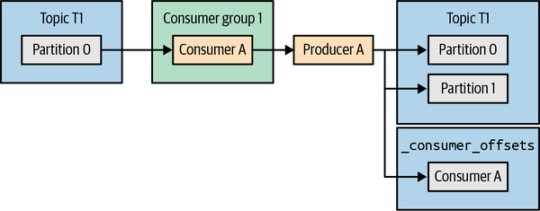
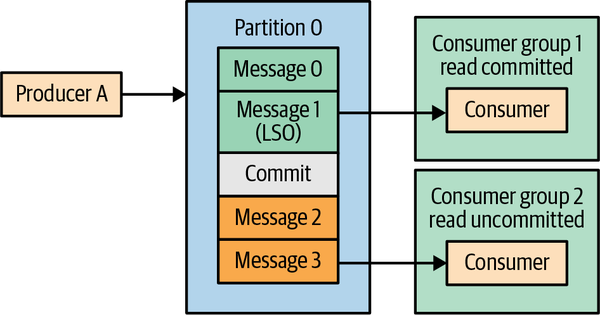
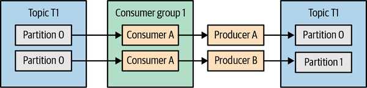
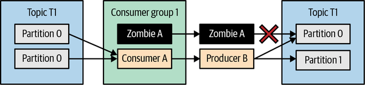

## 카프카 핵심 가이드

### 정확히 한 번 처리

Exactly-once는 메시지가 절대 한 번만 네트워크를 지나간다는 의미가 아님

카프카에서는 보통 "읽기 -> 처리 -> 쓰기" 흐름에서 결과가 한 번만 반영되도록 보장하는 의미

재시도, 장애, 리밸런스, 좀비 프로듀서 상황에서도 중복 결과나 누락 결과를 줄이는 것이 핵심

<br>

### 왜 필요한가

7장에서 신뢰성 있는 전달을 다루었지만, 재시도만으로는 중복 가능성을 제거할 수 없음

프로듀서가 응답을 받기 전에 네트워크 오류가 나면 메시지가 실제로 저장되었는지 모를 수 있음

이때 단순 재시도는 같은 레코드를 두 번 쓸 수 있음

<br>

정확히 한 번 처리는 두 계층으로 나뉨:
- 멱등성 프로듀서: 프로듀서 재시도로 인한 중복 쓰기 방지
- 트랜잭션: 여러 파티션 쓰기와 컨슈머 오프셋 커밋을 하나의 원자적 작업으로 묶음

<br>

### 멱등성 프로듀서

`enable.idempotence`: 프로듀서 재시도로 같은 메시지가 중복 저장되는 것을 방지

브로커는 프로듀서 ID와 시퀀스 번호를 이용해 이미 받은 배치를 구분

같은 프로듀서가 같은 파티션에 보낸 배치의 순서를 추적하여 중복 배치를 무시

<br>

### 멱등성 프로듀서 동작 방식

멱등성 프로듀서는 각 레코드 배치에 다음 정보를 포함

- `producer.id`
- `producer epoch`
- sequence number
- topic/partition

<br>

브로커는 파티션별 마지막 시퀀스 번호를 기억

이미 처리한 시퀀스 번호가 다시 오면 중복으로 판단

예상보다 큰 시퀀스 번호가 오면 순서가 깨진 것으로 판단

<br>

### 멱등성 프로듀서의 한계

멱등성 프로듀서는 단일 프로듀서 세션 안의 중복 쓰기를 막는 기능

프로듀서가 재시작되어 새로운 `producer.id`를 받으면 이전 세션과 같은 논리 작업인지 알 수 없음

서로 다른 프로듀서가 같은 레코드를 쓰는 중복까지 자동 제거하지 않음

컨슈머 오프셋 커밋과 결과 토픽 쓰기를 하나의 작업으로 묶지도 않음

<br>

따라서 read-process-write 파이프라인의 정확히 한 번 처리는 트랜잭션이 필요

<br>

### 멱등성 프로듀서 설정

현대 Kafka에서는 충돌 설정이 없으면 멱등성 프로듀서가 기본 활성화될 수 있음

운영 Kafka 버전과 클라이언트 설정을 반드시 확인

<br>

멱등성 프로듀서의 주요 조건:
- `acks=all`
- `retries > 0`
- `max.in.flight.requests.per.connection <= 5`

<br>

설정이 충돌하면 멱등성이 비활성화되거나 `ConfigException`이 발생할 수 있음

<br>

### 트랜잭션

트랜잭션은 여러 파티션에 대한 쓰기와 컨슈머 오프셋 커밋을 하나의 원자적 작업으로 묶는 기능

결과 레코드는 쓰였지만 오프셋은 커밋되지 않는 상황, 또는 오프셋은 커밋됐지만 결과 레코드는 없는 상황을 방지

<br>

트랜잭션은 멱등성 프로듀서를 기반으로 동작

`transactional.id`를 설정하면 트랜잭션 프로듀서가 되고, 멱등성도 함께 필요해짐

<br>

### 트랜잭션이 해결하는 문제

스트림 처리 애플리케이션은 일반적으로 다음 흐름을 가짐:

1. 입력 토픽에서 메시지 읽기
2. 메시지 처리
3. 출력 토픽에 결과 쓰기
4. 입력 토픽 오프셋 커밋

<br>

장애가 3번과 4번 사이에서 발생하면 결과는 쓰였지만 오프셋은 커밋되지 않을 수 있음

재시작 후 같은 입력을 다시 읽으면 결과가 중복 생성

트랜잭션은 출력 쓰기와 오프셋 커밋을 함께 commit/abort하여 이 문제를 줄임

<br>



<br>

### 좀비 프로듀서 방지

좀비 프로듀서: 장애나 리밸런스 이후 더 이상 유효하지 않은 인스턴스가 계속 쓰기를 시도하는 상황

`transactional.id`는 같은 논리 프로듀서를 재시작 후에도 식별하기 위해 사용

브로커는 `transactional.id`마다 epoch를 관리

새 인스턴스가 같은 `transactional.id`로 초기화되면 epoch가 증가

낮은 epoch를 가진 이전 인스턴스의 write/commit/abort 요청은 거절

<br>

이 과정을 fencing이라고 하며, 좀비 인스턴스의 중복 쓰기를 막는 데 사용

<br>

### read_committed

트랜잭션으로 쓴 레코드는 커밋 전에도 로그에 저장될 수 있음

컨슈머가 어떤 레코드를 볼지는 `isolation.level`에 따라 달라짐

<br>

`read_uncommitted`
- 기본 모드
- 커밋되지 않았거나 abort된 트랜잭션 레코드도 읽을 수 있음

<br>

`read_committed`
- 커밋된 트랜잭션 레코드만 반환
- abort된 트랜잭션 레코드는 건너뜀
- 열린 트랜잭션 뒤의 레코드는 트랜잭션 종료 전까지 보이지 않을 수 있음

<br>



<br>

### 트랜잭션이 해결하지 않는 문제

트랜잭션은 카프카 내부의 read-process-write 흐름에 강함

하지만 모든 외부 시스템 문제를 자동으로 해결하지는 않음

<br>

해결하지 않는 대표 문제:
- 외부 DB 쓰기와 Kafka 오프셋 커밋을 자동으로 원자화하지 않음
- 애플리케이션 로직이 같은 입력을 다른 방식으로 처리하는 문제는 막지 못함
- 서로 다른 시스템 간 end-to-end exactly-once는 별도 설계 필요
- `read_committed` 컨슈머도 자기 오프셋 커밋을 잘못하면 중복/유실 가능

<br>

외부 시스템과 함께 사용한다면 idempotent write, outbox 패턴, 상태 저장소, 보상 처리 등을 별도로 고려해야 함

<br>

### 트랜잭션 사용 흐름

트랜잭션 프로듀서 기본 흐름:

```java
producer.initTransactions();

while (true) {
    ConsumerRecords<String, String> records = consumer.poll(Duration.ofMillis(100));

    producer.beginTransaction();
    try {
        for (ConsumerRecord<String, String> record : records) {
            ProducerRecord<String, String> result = process(record);
            producer.send(result);
        }

        producer.sendOffsetsToTransaction(offsets, consumer.groupMetadata());
        producer.commitTransaction();
    } catch (ProducerFencedException e) {
        producer.close();
        throw e;
    } catch (Exception e) {
        producer.abortTransaction();
    }
}
```

<br>

주의사항:
- `enable.auto.commit=false`
- 컨슈머 오프셋은 `sendOffsetsToTransaction()`으로 트랜잭션에 포함
- 처리 중 예외가 나면 `abortTransaction()`
- `ProducerFencedException`은 현재 인스턴스가 좀비가 되었음을 의미하므로 종료

<br>

### 트랜잭션 레코드 처리기

입력 파티션과 출력 파티션의 매핑이 명확해야 좀비 fencing을 안정적으로 적용 가능

각 작업 단위가 고유한 `transactional.id`를 가져야 함

리밸런스 이후 새 인스턴스가 같은 작업 단위를 이어받으면 이전 인스턴스는 fencing됨

<br>



<br>

리밸런스나 장애로 이전 인스턴스가 좀비가 되면, 새 인스턴스의 epoch가 더 높아짐

낮은 epoch의 좀비 프로듀서가 같은 파티션에 쓰려 하면 브로커가 거절

<br>



<br>

### 트랜잭션 내부 동작

트랜잭션은 브로커의 transaction coordinator가 관리

핵심 구성:
- `transactional.id`
- transaction coordinator
- transaction log
- commit/abort marker
- transaction timeout

<br>

동작 흐름:
1. 프로듀서가 `initTransactions()` 호출
2. 브로커가 `transactional.id`와 producer ID/epoch를 매핑
3. 프로듀서가 `beginTransaction()` 호출
4. 여러 파티션에 레코드 쓰기
5. 필요하면 `sendOffsetsToTransaction()`으로 오프셋 포함
6. `commitTransaction()` 또는 `abortTransaction()` 호출
7. coordinator가 transaction log에 의도를 기록
8. 관련 파티션에 commit/abort marker 기록

<br>

coordinator 장애가 나도 transaction log의 의도를 기준으로 새 coordinator가 이어서 처리 가능

`transaction.timeout.ms` 안에 완료되지 않은 트랜잭션은 브로커가 abort

<br>

### 브로커 트랜잭션 설정

운영에서 확인할 설정:

- `transaction.state.log.replication.factor`
- `transaction.state.log.min.isr`
- `transaction.max.timeout.ms`
- `transactional.id.expiration.ms`

<br>

트랜잭션 상태 토픽도 카프카 내부 토픽이므로 복제와 ISR 설정이 중요

개발 환경에서는 낮출 수 있지만 운영 환경에서는 장애 허용 범위를 기준으로 설정

<br>

### 성능 영향

트랜잭션은 프로듀서에 추가 오버헤드를 만듦

트랜잭션 시작/커밋/abort 과정과 commit marker 기록이 필요

짧은 트랜잭션을 너무 자주 커밋하면 처리량이 떨어질 수 있음

<br>

컨슈머는 `read_committed` 모드에서 열린 트랜잭션 뒤의 데이터를 기다릴 수 있음

트랜잭션 크기와 커밋 주기는 지연시간과 처리량의 trade-off

<br>

### 운영 관점 체크 포인트

- 단순 재시도 중복 방지: 멱등성 프로듀서 확인
- read-process-write 원자성: 트랜잭션 사용
- 컨슈머 설정: `isolation.level=read_committed`
- 오프셋 처리: 자동 커밋 끄고 `sendOffsetsToTransaction()` 사용
- 좀비 방지: 작업 단위별 안정적인 `transactional.id` 설계
- 성능: 트랜잭션 범위와 커밋 주기 조정
- 외부 시스템: Kafka 트랜잭션만으로 end-to-end exactly-once가 되는지 별도 검증

<br>
