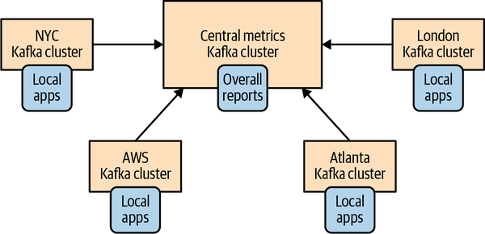
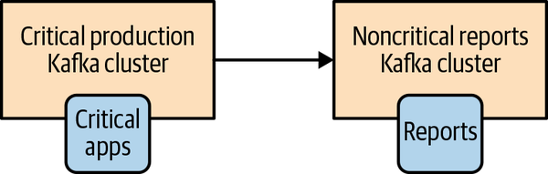
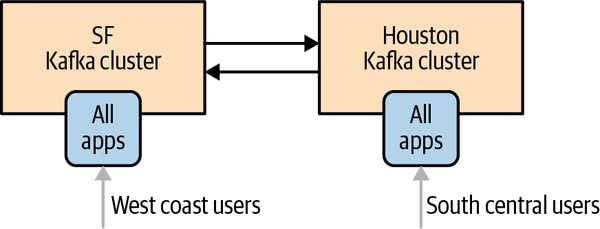
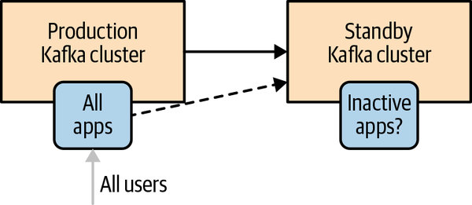
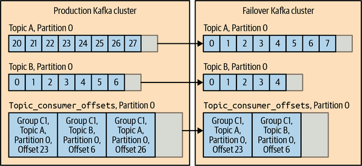
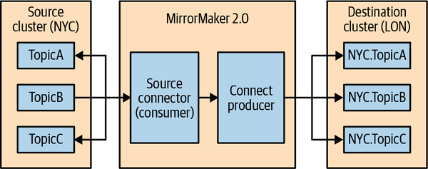

## 카프카 핵심 가이드

### 클러스터 간 데이터 미러링

서로 다른 카프카 클러스터 사이에 데이터를 복사하는 작업을 미러링이라고 함

같은 클러스터 안의 레플리카 복제와 구분하기 위해, 클러스터 간 데이터 복사는 mirroring으로 표현

Apache Kafka의 대표 미러링 도구는 MirrorMaker

<br>

### 미러링이 필요한 경우

여러 클러스터가 완전히 독립적이면 데이터를 복사할 필요가 없음

하지만 지역, 보안, DR, 클라우드 이전 같은 요구사항이 있으면 클러스터 간 데이터 흐름이 필요

<br>

대표 사용 사례:
- 지역 클러스터와 중앙 집계 클러스터
- 고가용성/재해 복구
- 보안과 규제 요구사항 분리
- 클라우드 마이그레이션
- edge cluster 데이터 집계

<br>

### 지역 클러스터와 중앙 집계

각 지역의 애플리케이션은 로컬 Kafka cluster에 쓰고 읽음

중앙 분석/리포팅 시스템은 여러 지역 클러스터의 데이터를 집계

지역 트래픽은 로컬에서 처리하고, 중앙 클러스터는 전체 리포트를 담당

<br>



<br>

### 고가용성과 재해 복구

운영 클러스터가 완전히 사용할 수 없게 되는 상황에 대비해 별도 클러스터를 준비

운영 클러스터의 데이터를 대기 클러스터로 계속 미러링

장애 시 애플리케이션을 대기 클러스터로 전환

<br>

중요한 지표:
- `RTO`: 장애 후 서비스를 다시 시작하기까지 허용되는 시간
- `RPO`: 장애로 잃어도 되는 데이터 범위

<br>

RTO를 낮추려면 failover 절차를 자동화해야 함

RPO를 낮추려면 미러링 지연을 줄이고 lag를 지속적으로 모니터링해야 함

<br>

### 미러링의 기본 원칙

클러스터 간 네트워크는 같은 클러스터 내부 네트워크보다 느리고 불안정할 수 있음

따라서 하나의 Kafka cluster를 여러 데이터센터에 무리하게 펼치는 것보다, 데이터센터마다 클러스터를 두고 필요한 데이터를 미러링하는 방식이 일반적

<br>

설계 원칙:
- 데이터센터당 최소 1개 클러스터
- 클러스터 간 통신은 미러링 프로세스가 담당
- 애플리케이션은 가능한 로컬 클러스터와 통신
- 클러스터 간 링크 장애를 정상적인 장애 조건으로 가정

<br>

### 멀티 클러스터 아키텍처

클러스터 간 미러링은 방향성과 토폴로지에 따라 운영 복잡도가 달라짐

대표 구조:
- hub-and-spoke
- active-active
- active-standby
- stretch cluster

<br>

### Hub-and-Spoke

여러 지역 클러스터가 중앙 클러스터로 데이터를 복제하는 구조

중앙 클러스터는 분석, 리포팅, 집계 작업을 담당

미러링 방향이 대체로 한 방향이므로 구성과 모니터링이 단순

<br>



<br>

더 단순한 형태는 중요 운영 클러스터에서 비중요 리포팅 클러스터로 데이터를 복제하는 구조

운영 트래픽과 분석/리포팅 트래픽을 분리할 수 있음

<br>

### Active-Active

둘 이상의 클러스터가 모두 active 상태로 애플리케이션 트래픽을 처리

각 지역 애플리케이션은 로컬 클러스터에 쓰고, 필요한 데이터는 서로 미러링

<br>

장점:
- 사용자와 가까운 지역에서 낮은 지연시간 제공
- 한 지역 장애 시 다른 지역에서 서비스 지속 가능
- 각 지역 클러스터가 실제 트래픽을 처리하므로 자원 낭비가 적음

<br>

단점:
- 양방향 복제가 필요
- topic naming과 replication cycle 방지 필요
- 충돌 처리와 데이터 정합성 설계가 어려움
- 여러 지역에서 같은 엔티티를 수정하면 애플리케이션 수준 조정 필요

<br>



<br>

### Active-Standby

운영 클러스터는 active, 대기 클러스터는 standby로 유지

평상시에는 운영 클러스터에서만 애플리케이션이 동작

운영 클러스터 데이터를 standby 클러스터로 계속 미러링

<br>



<br>

장점:
- 구조가 active-active보다 단순
- 재해 복구 목적으로 이해하기 쉬움

<br>

단점:
- standby 자원이 평상시 놀 수 있음
- failover 절차가 복잡
- DR 클러스터가 primary보다 뒤처질 수 있음
- consumer offset과 실제 레코드 위치가 맞지 않을 수 있음

<br>

### Failover와 offset 문제

미러링은 일반적으로 비동기 방식

장애 시 DR 클러스터가 primary 클러스터의 최신 데이터를 모두 가지고 있다고 보장할 수 없음

<br>

문제 상황:
- 레코드는 아직 DR로 복제되지 않았는데 consumer offset은 복제됨
- 레코드는 복제됐지만 offset commit은 복제되지 않음
- primary와 DR의 topic offset 번호가 서로 다름

<br>

단순히 `__consumer_offsets` 토픽을 복제한다고 항상 해결되는 것은 아님

소스 클러스터와 대상 클러스터의 offset은 서로 달라질 수 있음

MirrorMaker 2는 checkpoint와 offset sync를 이용해 offset translation을 지원

<br>



<br>

### Failback

DR 클러스터로 failover한 뒤 원래 primary 클러스터를 어떻게 처리할지도 미리 정해야 함

단순히 미러링 방향만 반대로 바꾸면 두 클러스터의 데이터가 불일치할 수 있음

<br>

안전한 절차:
- 어떤 클러스터가 새로운 source of truth인지 결정
- 이전 primary의 남은 데이터와 offset 상태 확인
- 필요하면 이전 primary 데이터를 정리한 뒤 다시 미러링
- 애플리케이션 bootstrap/discovery 설정을 함께 전환

<br>

### 클러스터 발견

애플리케이션이 broker 주소를 하드코딩하면 failover가 어려움

DNS, service discovery, 설정 관리 시스템 등을 이용해 클러스터 주소를 전환할 수 있어야 함

<br>

클라이언트는 bootstrap broker 중 하나에 연결해 메타데이터를 받아오므로, failover 시 새 클러스터 bootstrap 주소를 올바르게 제공해야 함

<br>

### Stretch Cluster

Stretch cluster는 여러 데이터센터에 하나의 Kafka cluster를 펼치는 방식

클러스터 간 미러링이 아니라 하나의 클러스터 내부 복제를 사용

<br>

장점:
- 별도 미러링 프로세스가 필요 없음
- 동기 복제를 이용하면 RPO를 낮출 수 있음
- 모든 브로커가 하나의 클러스터로 동작

<br>

단점:
- 데이터센터 간 네트워크 지연시간과 대역폭 요구사항이 높음
- 장애 도메인 설계가 까다로움
- ZooKeeper 기반 구성에서는 quorum 배치가 중요
- KRaft 기반 구성도 controller quorum 배치와 네트워크 조건을 신중히 설계해야 함

<br>

Stretch cluster는 가까운 데이터센터, 충분한 네트워크 품질, 강한 동기화 요구사항이 있을 때만 신중히 고려

<br>

### MirrorMaker 2

MirrorMaker 2는 Kafka Connect 기반의 클러스터 간 미러링 도구

source cluster에서 데이터를 읽어 target cluster에 쓰는 replication flow를 구성

Kafka Connect의 source connector/task 모델을 사용하므로 분산 실행과 장애 복구를 활용 가능

<br>

MirrorMaker 2가 지원하는 기능:
- topic data replication
- consumer offset checkpoint
- topic configuration migration
- ACL migration
- active-active / active-standby topology
- topic prefix 기반 replication cycle 방지

<br>

### MirrorMaker 2 동작 구조

MirrorMaker는 source cluster를 읽고 destination cluster에 쓰는 consumer/producer 조합으로 볼 수 있음

각 task는 파티션을 나눠 맡아 병렬로 복제

source topic은 target cluster에서 원격 topic 이름으로 생성됨

기본 정책에서는 source cluster alias가 topic 이름 앞에 붙음

<br>



<br>

예시:
```text
NYC.TopicA -> LON.NYC.TopicA
```

<br>

이 prefix 전략은 active-active 환경에서 replication loop를 방지하는 데 도움

<br>

### MirrorMaker 2 설정

기본 설정 요소:

- `clusters`
- `{cluster}.bootstrap.servers`
- `{source}->{target}.enabled`
- `topics`
- `topics.exclude`
- `groups`
- `groups.exclude`
- `tasks.max`
- `replication.policy.class`
- `replication.policy.separator`

<br>

단방향 replication flow:
```text
clusters = primary, secondary
primary.bootstrap.servers = primary:9092
secondary.bootstrap.servers = secondary:9092
primary->secondary.enabled = true
```

<br>

양방향 replication flow:
```text
primary->secondary.enabled = true
secondary->primary.enabled = true
```

<br>

양방향 구성에서는 topic 이름과 replication policy를 통해 무한 복제 루프를 방지해야 함

<br>

### Offset과 checkpoint

MirrorMaker 2는 consumer group offset을 대상 클러스터로 옮기는 기능을 제공

단순 offset 복사가 아니라 source offset과 target offset의 매핑이 필요

checkpoint를 이용하면 failover 시 대상 클러스터에서 적절한 위치로 이동 가능

<br>

관련 개념:
- checkpoint topic
- offset sync
- group offset sync
- offset translation

<br>

DR 전환 전에 checkpoint lag와 replication lag를 확인해야 함

<br>

### ACL과 topic 설정 복제

데이터 레코드만 복제하면 운영 전환 시 topic 설정이나 권한이 맞지 않을 수 있음

MirrorMaker 2는 topic configuration과 ACL migration을 지원

<br>

주의사항:
- 모든 권한 모델이 자동으로 완벽히 복제되는 것은 아님
- prefix/패턴 ACL은 별도 검토 필요
- target cluster에서 MirrorMaker만 write 가능하도록 제한해야 함
- 보안 설정은 cluster별로 명시적으로 확인 필요

<br>

### 위치 배치 원칙

MirrorMaker 프로세스는 일반적으로 target cluster에 가깝게 두는 것이 유리

Kafka producer는 고지연/불안정 네트워크에 더 민감하기 때문

즉, 원격 cluster에서 consume하고 로컬 cluster에 produce하는 구조가 권장됨

<br>

```text
source cluster -> MirrorMaker near target -> target cluster
```

<br>

### 모니터링

미러링은 장애 시점에만 중요한 것이 아니라 평상시에도 계속 검증해야 함

모니터링 대상:
- replication lag
- checkpoint lag
- replication throughput
- MirrorMaker task 상태
- Connect worker 상태
- failed records
- source/target cluster 연결 상태

<br>

DR 용도라면 "얼마나 뒤처져 있는가"가 곧 RPO와 연결됨

RTO/RPO 목표에 맞춰 alert 기준을 잡아야 함

<br>

### 운영 관점 체크 포인트

- 클러스터 간 네트워크 지연시간과 대역폭 확인
- topology 선택: hub-and-spoke, active-active, active-standby, stretch cluster
- active-active는 replication cycle과 데이터 충돌 처리 설계
- active-standby는 failover/failback 절차를 문서화
- consumer offset translation 검증
- topic config와 ACL migration 검증
- MirrorMaker process는 target cluster 근처에 배치
- replication lag와 checkpoint lag 모니터링
- 실제 장애 훈련으로 RTO/RPO 확인

<br>
