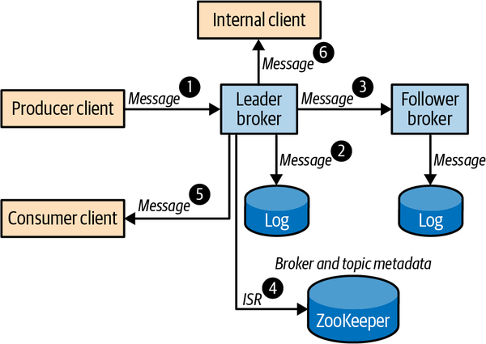
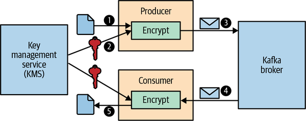

## 카프카 핵심 가이드

### 카프카 보안

카프카는 웹 활동 추적, 지표 수집, 환자 기록, 결제 시스템처럼 민감도와 요구사항이 다른 여러 용도에 사용됨

보안은 성능, 비용, 사용성, 운영 복잡도와 함께 설계해야 하는 시스템 속성

특정 broker나 client 하나만 안전하게 만드는 것이 아니라, Kafka cluster와 주변 platform 전체를 하나의 보안 모델로 다뤄야 함

<br>

### 보안의 주요 목표

Kafka deployment를 안전하게 만들기 위해 확인해야 하는 항목:
- authentication
- authorization
- encryption
- auditing
- quotas

<br>

`Authentication`: 사용자가 누구인지 확인

`Authorization`: 확인된 사용자가 무엇을 할 수 있는지 결정

`Encryption`: 전송 중인 데이터와 저장된 데이터를 도청/변조로부터 보호

`Auditing`: 어떤 작업이 수행되었거나 시도되었는지 추적

`Quotas`: 특정 사용자가 broker 자원을 과도하게 점유하지 못하게 제한

<br>

### 데이터 흐름과 보호 지점

Kafka 보안은 message가 cluster 안에서 이동하는 경로를 기준으로 생각하면 이해하기 쉬움

producer가 leader broker에 record를 쓰고, leader는 log에 저장한 뒤 follower와 replica를 동기화

consumer는 broker에서 record를 읽고, 내부 애플리케이션도 같은 topic을 처리할 수 있음

<br>



<br>

보호해야 할 지점:
- producer와 broker 사이의 client authentication
- client가 진짜 broker에 연결했는지 확인하는 server authentication
- broker 간 replication traffic
- log file과 storage
- topic/group/cluster resource에 대한 access control
- broker와 metadata store 사이의 통신
- operation log와 request log

<br>

### 보안 프로토콜

Kafka broker는 하나 이상의 listener를 열고 client connection을 받음

각 listener는 서로 다른 security protocol을 가질 수 있음

내부망 전용 listener와 외부 노출 listener는 같은 보안 수준을 가질 필요가 없음

<br>

Kafka의 대표 security protocol:
- `PLAINTEXT`
- `SSL`
- `SASL_PLAINTEXT`
- `SASL_SSL`

<br>

`PLAINTEXT`는 인증과 암호화가 없음

민감하지 않은 데이터와 물리적으로 보호된 사설망에서만 제한적으로 고려

<br>

`SSL`은 TLS transport를 사용

server authentication, encryption, optional client authentication을 제공

<br>

`SASL_PLAINTEXT`는 SASL 기반 client authentication을 제공하지만 transport encryption은 없음

민감한 데이터가 오가는 네트워크에는 적합하지 않음

<br>

`SASL_SSL`은 TLS transport 위에서 SASL authentication을 사용

외부망이나 불신 네트워크에서 가장 일반적으로 선택할 수 있는 조합

<br>

### Listener 구성

보안 설정은 listener 단위로 나누어 설계 가능

예를 들어 외부 client는 `SASL_SSL`, 내부 client와 inter-broker traffic은 `SSL` listener를 사용할 수 있음

<br>

```properties
listeners=EXTERNAL://:9092,INTERNAL://10.0.0.2:9093,BROKER://10.0.0.2:9094
advertised.listeners=EXTERNAL://broker1.example.com:9092,INTERNAL://broker1.local:9093,BROKER://broker1.local:9094
listener.security.protocol.map=EXTERNAL:SASL_SSL,INTERNAL:SSL,BROKER:SSL
inter.broker.listener.name=BROKER
```

<br>

client는 `bootstrap.servers`와 `security.protocol`을 통해 어떤 listener를 사용할지 결정

broker metadata에는 해당 listener에 맞는 advertised endpoint가 반환됨

<br>

```properties
security.protocol=SASL_SSL
bootstrap.servers=broker1.example.com:9092,broker2.example.com:9092
```

<br>

### Authentication

Authentication은 connection을 만든 client와 server의 identity를 확인하는 과정

인증이 끝나면 Kafka는 연결에 `KafkaPrincipal`을 부여

이 principal은 authorization, quota, audit log의 기준이 됨

<br>

인증되지 않은 connection은 `User:ANONYMOUS` principal로 처리

운영 환경에서는 anonymous connection이 의도한 것인지 명확히 확인해야 함

<br>

### TLS/SSL

`SSL` 또는 `SASL_SSL` listener에서는 TLS가 transport layer로 사용됨

TLS handshake 과정에서 server certificate를 검증하고, 암호화에 사용할 key를 협상

SSL client authentication을 켜면 broker가 client certificate도 검증

<br>

TLS를 사용할 때 필요한 구성:
- broker private key와 certificate가 들어 있는 key store
- client가 broker certificate를 검증할 trust store
- client authentication을 쓸 경우 client key store
- broker가 client certificate를 검증할 trust store

<br>

broker certificate에는 client가 접속하는 hostname이 `SAN` 또는 `CN`으로 포함되어야 함

hostname verification은 man-in-the-middle attack을 막는 핵심 장치이므로 운영 환경에서 끄지 않아야 함

<br>

SSL channel은 암호화 때문에 CPU overhead가 있음

보안 요구사항과 처리량 요구사항을 함께 보고 sizing해야 함

<br>

### SASL

SASL은 connection-oriented protocol에서 authentication을 제공하는 framework

Kafka는 여러 SASL mechanism을 지원하고, listener별로 허용할 mechanism을 설정할 수 있음

<br>

대표 mechanism:
- `GSSAPI`
- `PLAIN`
- `SCRAM-SHA-256`
- `SCRAM-SHA-512`
- `OAUTHBEARER`

<br>

broker는 `sasl.enabled.mechanisms`로 사용할 mechanism을 열고, client는 `sasl.mechanism`으로 선택

inter-broker communication에도 SASL을 사용할 수 있으며, 이때는 `sasl.mechanism.inter.broker.protocol`을 함께 설정

<br>

### SASL/GSSAPI

`GSSAPI`는 Kerberos 기반 인증

이미 Kerberos 인프라를 사용하는 조직에서 Kafka를 통합할 때 적합

server authentication을 제공할 수 있지만, 안전한 DNS와 Kerberos 운영이 전제됨

<br>

주의사항:
- keytab 파일 권한 보호
- 오래된 encryption algorithm 회피
- Kerberos principal mapping 검토
- DNS와 KDC 가용성 확보

<br>

### SASL/PLAIN

`PLAIN`은 username/password를 사용하는 단순한 인증 방식

credential이 평문 형태로 전달될 수 있으므로 반드시 `SASL_SSL`과 함께 사용해야 함

<br>

개발이나 작은 내부 환경에서는 간단하지만, 운영에서는 외부 password store나 custom callback handler를 고려해야 함

broker 설정 파일에 모든 사용자 password를 직접 넣는 방식은 관리와 유출 위험이 큼

<br>

### SASL/SCRAM

`SCRAM`은 username/password 기반이지만 password를 그대로 보내지 않는 challenge-response 방식

Kafka는 `SCRAM-SHA-256`과 `SCRAM-SHA-512`를 지원

<br>

`SASL/PLAIN`보다 안전한 기본 선택지로 볼 수 있음

다만 brute-force attack 방지, password policy, credential 저장소 보호가 함께 필요

<br>

ZooKeeper 기반 cluster에서는 SCRAM credential metadata가 ZooKeeper에 저장될 수 있으므로 ZooKeeper 보안도 중요

KRaft 기반 Kafka에서는 metadata quorum과 관련 설정이 버전에 따라 다르므로 운영 중인 Kafka 버전 문서를 기준으로 확인해야 함

<br>

### SASL/OAUTHBEARER

`OAUTHBEARER`는 OAuth bearer token을 이용한 인증

외부 identity provider와 연동하거나 짧은 수명의 token을 사용해야 하는 환경에 적합

<br>

broker는 token을 검증하고, client는 OAuth server에서 token을 받아 Kafka connection에 사용

token validation, token lifetime, callback handler 구성이 핵심

<br>

### Reauthentication

Kafka client connection은 오래 유지될 수 있음

한 번 인증된 연결이 너무 오래 지속되면 credential이 폐기된 뒤에도 기존 연결이 계속 동작할 수 있음

<br>

reauthentication을 사용하면 장기 연결에서도 주기적으로 credential을 다시 검증할 수 있음

user compromise나 credential rotation 시 노출 범위를 줄이는 데 도움이 됨

<br>

### 무중단 보안 변경

보안 설정 변경은 rolling update로 진행해야 함

새 listener나 새 SASL mechanism을 먼저 추가하고, client를 옮긴 뒤, 기존 설정을 제거하는 순서가 안전

<br>

예시 절차:
- 새 보안 listener 추가
- broker rolling restart
- client 설정 변경
- traffic 전환 확인
- 기존 listener 또는 mechanism 제거
- broker rolling restart

<br>

### Encryption

Encryption은 data privacy와 integrity를 보호

Kafka에서 고려해야 하는 암호화 범위:
- data in transit
- data at rest
- end-to-end encryption

<br>

TLS는 client-broker, broker-broker, broker-metadata store 사이의 network traffic을 보호

disk encryption이나 volume encryption은 broker storage가 탈취되었을 때 data at rest를 보호

<br>

Kafka broker는 record value를 이해하지 않아도 저장하고 복제할 수 있음

따라서 매우 민감한 데이터는 producer가 암호화하고 consumer가 복호화하는 end-to-end encryption을 적용할 수 있음

<br>



<br>

end-to-end encryption을 쓰면 broker, cloud provider, platform administrator도 message payload를 읽을 수 없음

대신 key management, schema evolution, compaction, 검색/필터링 가능성은 더 복잡해짐

<br>

### Authorization

Authorization은 인증된 principal이 어떤 resource에 어떤 operation을 수행할 수 있는지 결정

Kafka는 authorizer를 통해 topic, consumer group, cluster, transactional id 같은 resource 접근을 제어

최신 KRaft 기반 Kafka의 기본 authorizer는 ACL을 cluster metadata에 저장하는 `StandardAuthorizer`

<br>

기본 원칙은 least privilege

애플리케이션이 필요한 topic과 group에 필요한 operation만 허용해야 함

<br>

대표 operation:
- `Read`
- `Write`
- `Create`
- `Delete`
- `Alter`
- `Describe`
- `ClusterAction`
- `IdempotentWrite`

<br>

대표 resource:
- `Topic`
- `Group`
- `Cluster`
- `TransactionalId`
- `DelegationToken`

<br>

### ACL

ACL은 principal, operation, resource, host, allow/deny를 조합한 rule

예를 들어 Alice에게 `customerOrders` topic에 대한 `Write` 권한을 부여하고, Bob에게 같은 topic과 consumer group에 대한 `Read` 권한을 부여할 수 있음

<br>

```bash
bin/kafka-acls.sh --bootstrap-server localhost:9092 \
  --command-config admin.props \
  --add --allow-principal User:Alice \
  --operation Write --topic customerOrders
```

<br>

consumer group을 사용하는 client는 topic read 권한뿐 아니라 group read 권한도 필요

transactional producer는 transactional id 권한도 확인해야 함

<br>

### ACL 설계 주의사항

wildcard ACL은 편하지만 권한 범위가 넓어질 수 있음

prefix ACL은 많은 resource를 다룰 때 유용하지만 naming convention이 명확해야 함

<br>

주의사항:
- `Deny` rule은 강력하므로 의도한 범위인지 확인
- 퇴사자나 폐기된 service principal의 ACL은 즉시 제거
- 장기 실행 애플리케이션은 개인 계정보다 service credential 사용
- principal 재사용은 과거 권한이 새 사용자에게 이어질 수 있으므로 피함
- broker도 internal operation을 수행할 권한이 필요

<br>

### Auditing

Kafka broker는 log4j 설정을 통해 authorization log와 request log를 남길 수 있음

`kafka.authorizer.logger`는 허용/거부된 authorization 결과를 추적

`kafka.request.logger`는 request 처리 정보를 추적

<br>

감사에서 확인할 항목:
- authentication failure
- authorization denied log
- principal
- client host
- client id
- operation
- resource
- security protocol

<br>

audit log는 단순 저장만으로 충분하지 않음

검색, 보존, 알림, 이상 징후 탐지가 가능하도록 로그 플랫폼과 연결해야 함

<br>

### ZooKeeper 보안

책의 설명은 ZooKeeper 기반 Kafka cluster를 기준으로 함

ZooKeeper는 Kafka metadata를 저장하므로, ZooKeeper가 안전하지 않으면 Kafka broker 보안도 약해짐

<br>

ZooKeeper 기반 cluster에서 확인할 항목:
- ZooKeeper SASL authentication
- ZooKeeper TLS
- `zookeeper.set.acl=true`
- metadata node ACL
- SCRAM credential이 저장되는 path 보호
- broker와 ZooKeeper 사이의 client credential 보호

<br>

Kafka 4.0 이상에서는 ZooKeeper가 제거되고 KRaft가 기본 구조

따라서 신규 Kafka cluster에서는 ZooKeeper 보안 절차를 그대로 적용하기보다 KRaft controller quorum, listener, ACL, metadata log 보안을 Kafka 버전에 맞춰 확인해야 함

<br>

### Platform 보안

Kafka 보안 설정만으로 전체 시스템이 안전해지는 것은 아님

network, host, filesystem, secret store, 운영 계정까지 함께 보호해야 함

<br>

확인할 항목:
- firewall과 network segmentation
- broker host 접근 제어
- disk/volume encryption
- key store, trust store, keytab 파일 권한
- 설정 파일 권한
- secret rotation
- 운영자 계정과 감사 로그

<br>

### Password Protection

Kafka 설정에는 trust store password, key store password, SASL credential 같은 민감 정보가 들어갈 수 있음

민감 정보를 평문 설정 파일에 오래 두는 것은 위험

<br>

Kafka는 config provider를 통해 외부 secret store나 암호화된 파일에서 값을 읽을 수 있음

예를 들어 설정에는 placeholder만 두고 실제 값은 provider가 runtime에 가져오도록 구성 가능

<br>

```properties
username=${gpg:/path/to/credentials.props.gpg:username}
password=${gpg:/path/to/credentials.props.gpg:password}
config.providers=gpg
config.providers.gpg.class=com.example.GpgProvider
```

<br>

핵심은 secret을 숨기는 것만이 아니라 접근 권한, rotation, audit까지 함께 관리하는 것

<br>

### 운영 관점 체크 포인트

- 외부 listener는 기본적으로 `SASL_SSL` 또는 `SSL` 사용
- hostname verification을 운영 환경에서 끄지 않음
- `PLAINTEXT` listener는 의도한 내부 범위로만 제한
- inter-broker traffic도 암호화와 인증 적용
- client별 principal을 분리하고 service credential 사용
- topic/group/transactional id ACL을 least privilege로 부여
- wildcard ACL과 `Deny` ACL은 영향 범위 확인
- authorization denied log와 authentication failure를 모니터링
- key store, trust store, keytab, config file 권한 보호
- credential rotation 절차를 rolling update와 함께 검증
- ZooKeeper 기반이면 ZooKeeper SASL/TLS/ACL까지 보호
- KRaft 기반이면 controller quorum과 metadata log 보안을 Kafka 버전에 맞춰 확인
- secret은 config provider나 외부 secret store로 관리

<br>
