## 카프카 핵심 가이드

### 스트림 처리

Kafka는 처음에는 durable message bus로 많이 사용됨

하지만 event가 계속 쌓이고, application이 그 event를 계속 읽을 수 있다면 Kafka는 stream processing의 기반이 됨

stream processing은 끝이 정해져 있지 않은 event stream을 계속 읽고, 변환하고, 집계하고, 다른 topic이나 외부 system으로 결과를 내보내는 작업

 

### Stream Processing이란

data 처리 방식은 크게 request-response, batch, stream processing으로 나눌 수 있음

`request-response`는 요청 하나에 대해 즉시 응답하는 방식

`batch processing`은 저장된 data를 일정 주기마다 모아서 처리하는 방식

`stream processing`은 event가 도착하는 즉시 또는 거의 즉시 처리하는 방식

 

stream processing은 다음과 같은 상황에서 유용함:
- fraud detection처럼 빠른 반응이 필요한 경우
- IoT event처럼 data가 계속 들어오는 경우
- clickstream enrichment처럼 event를 다른 정보와 결합해야 하는 경우
- 실시간 metric, alert, dashboard를 만들어야 하는 경우
- database 변경 이력을 다른 system으로 전달해야 하는 경우

 

Kafka Streams는 별도 cluster가 필요한 stream processing framework가 아니라 Java application 안에 포함되는 client library

따라서 application은 Kafka consumer처럼 topic을 읽고, producer처럼 topic에 쓰며, 중간 처리 상태는 local state store와 Kafka 내부 topic으로 관리함

 

### Topology

stream processing application은 하나 이상의 topology로 구성됨

topology는 source stream에서 시작해 여러 processor를 거친 뒤 sink stream으로 끝나는 처리 graph

 

구성 요소:
- source processor: Kafka topic에서 data를 읽는 시작점
- stream processor: filter, map, groupBy, count, join 같은 처리 단계
- sink processor: 처리 결과를 Kafka topic이나 외부 system으로 쓰는 끝점
- stream: processor 사이를 흐르는 event

 

topology는 논리적으로는 처리 단계의 graph이고, 실행 시에는 topic partition 수와 repartition 여부에 따라 task로 나뉨

이 차이를 구분해야 확장성과 장애 복구를 이해할 수 있음

 

### Time

stream processing에서 time은 단순한 timestamp가 아님

event가 실제로 발생한 시간과 application이 처리한 시간이 다를 수 있고, 늦게 도착한 event를 어떻게 처리할지도 정해야 함

 

주요 시간 개념:
- event time
- log append time
- processing time

 

`event time`은 event가 실제로 발생한 시간

대부분의 업무 기준 집계는 event time을 기준으로 해야 함

예를 들어 오늘 생산된 장비 수를 계산한다면, Kafka에 도착한 시간이 아니라 실제 생산 시간이 중요함

 

`log append time`은 broker가 record를 log에 저장한 시간

실제 event time을 알 수 없을 때 보조 기준으로 사용할 수 있지만, 업무 event가 발생한 시간과 다를 수 있음

 

`processing time`은 stream processing application이 event를 읽어 처리한 시간

같은 event라도 언제 읽었는지에 따라 값이 달라질 수 있으므로 window 집계 기준으로 쓰면 결과가 흔들릴 수 있음

 

Kafka Streams는 `TimestampExtractor`를 통해 record timestamp를 결정함

application이 원하는 event time이 payload 안에 있다면 직접 extractor를 구현해 일관된 시간 기준을 써야 함

 

### State

event 하나만 보고 처리할 수 있으면 stream processing은 단순함

예를 들어 log stream에서 `ERROR`만 골라 다른 topic으로 보내는 작업은 local state가 필요 없음

 

하지만 다음 작업은 state가 필요함:
- count
- sum
- average
- min/max
- window aggregation
- stream-table join
- stream-stream join

 

state는 여러 event를 함께 기억해야 할 때 필요한 중간 결과

state를 단순히 process memory 변수에만 두면 application restart나 crash 때 결과가 깨짐

그래서 stream processing framework는 state persistence와 recovery를 함께 제공해야 함

 

### Local State와 External State

`local state`는 stream processing application instance가 직접 들고 있는 state

Kafka Streams는 보통 embedded RocksDB 기반 state store를 사용하고, 변경 내역을 Kafka changelog topic에 기록함

장애가 나면 local state를 changelog topic에서 다시 만들 수 있음

 

장점:
- network hop이 적어 빠름
- partition 단위로 분산하기 쉬움
- Kafka의 log와 같이 복구할 수 있음

 

주의할 점:
- state 크기가 커지면 disk와 memory 사용량이 커짐
- rebalance 시 state 복구 시간이 필요함
- changelog topic 설정과 compaction이 중요함

 

`external state`는 Cassandra, Redis, database 같은 외부 저장소를 조회하거나 갱신하는 방식

용량은 커질 수 있지만, 매 event마다 외부 조회를 하면 latency와 availability 문제가 생김

stream processing에서는 가능하면 외부 조회를 줄이고, CDC나 table stream을 통해 local state로 가져오는 방식이 더 안정적임

 

### Stream-Table Duality

stream은 변경 이력이고, table은 어느 시점의 현재 상태

table의 변경 event를 순서대로 모으면 stream이 되고, stream의 변경을 처음부터 적용하면 table을 만들 수 있음

이 관계를 stream-table duality라고 볼 수 있음

 

예를 들어 재고 event stream이 다음과 같다고 가정:
- 입고
- 판매
- 반품
- 판매

 

event 하나하나는 변경 이력이고, 이 event들을 모두 적용한 결과가 현재 재고 table

Kafka Streams의 `KStream`은 event 흐름을, `KTable`은 key별 최신 상태를 표현하는 데 가깝게 사용됨

 

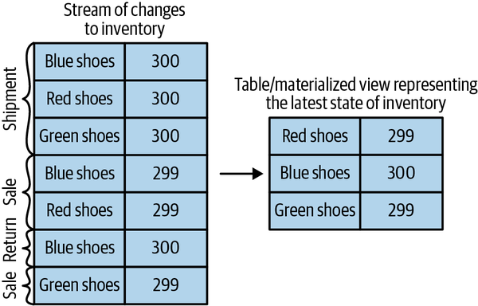

 

### Time Windows

대부분의 stream aggregation은 window 단위로 수행됨

전체 stream은 끝이 없기 때문에, 특정 시간 구간을 잘라서 count, average, join 같은 연산을 수행해야 함

 

window를 설계할 때 정해야 하는 것:
- window size
- advance interval
- grace period

 

`window size`는 하나의 window가 포함하는 시간 범위

5분 평균, 1시간 count, 하루 매출 같은 기준이 여기에 해당함

 

`advance interval`은 window가 얼마나 자주 이동하는지 나타냄

window size와 advance interval이 같으면 tumbling window

window size보다 advance interval이 작으면 hopping window

 

`grace period`는 늦게 도착한 event를 어느 시점까지 기존 window에 반영할지 정하는 값

grace period가 너무 짧으면 늦은 event를 버리기 쉽고, 너무 길면 state를 오래 유지해야 함

 

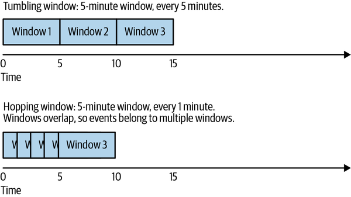

 

### Processing Guarantees

stream processing에서는 장애가 발생해도 각 record가 의도한 방식대로 처리되어야 함

특히 집계나 join 결과는 중복 처리에 민감함

 

Kafka Streams는 Kafka의 idempotent producer와 transaction을 이용해 exactly-once semantics를 제공함

application에서는 `processing.guarantee` 설정으로 처리 보장 수준을 선택함

 

책의 예시는 `exactly_once`, `exactly_once_beta` 흐름을 설명함

다만 Kafka Streams 설정 값은 Kafka version에 따라 바뀔 수 있으므로, 실제 운영에서는 배포 중인 Kafka 공식 문서의 `processing.guarantee` 값을 확인해야 함

최신 계열에서는 `exactly_once_v2` 같은 값이 사용됨

 

### Single-Event Processing

가장 단순한 stream processing pattern은 event를 하나씩 독립적으로 처리하는 방식

filter, map, validation, format conversion이 여기에 해당함

 

예:
- log stream에서 error log만 별도 topic으로 전송
- JSON event를 Avro event로 변환
- 불필요한 field 제거
- routing key에 따라 output topic 분리

 

이 pattern은 state가 없으므로 확장과 복구가 단순함

consumer-producer 조합만으로도 구현할 수 있고, Kafka Streams를 쓰면 topology 형태로 더 일관되게 표현할 수 있음

 

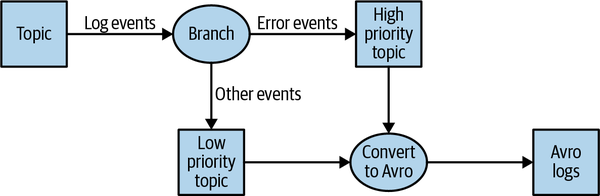

 

### Processing with Local State

count, average, min/max처럼 여러 event를 모아 결과를 만드는 작업은 local state가 필요함

Kafka Streams는 key별로 data를 partition에 배치하고, 같은 key를 같은 task에서 처리하도록 만들어 local state 집계를 가능하게 함

 

예를 들어 주식 symbol별 일별 최저가, 최고가, 평균가를 계산한다면 symbol을 key로 사용함

같은 symbol의 거래 event가 같은 partition으로 들어오면, 해당 partition을 담당하는 task가 필요한 state를 local에 유지할 수 있음

 

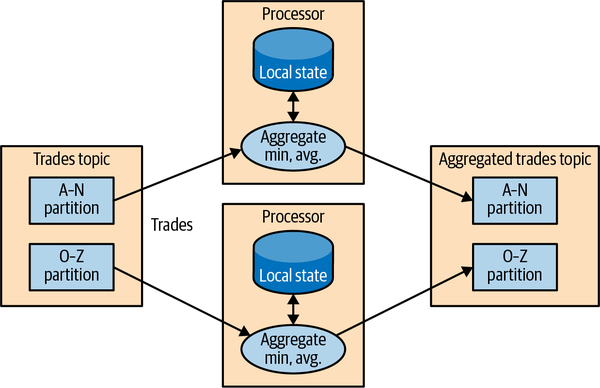

 

local state가 있는 application에서 특히 봐야 할 것:
- state store 크기
- changelog topic compaction
- rebalance 시 복구 시간
- standby replica 필요 여부
- window와 grace period가 만드는 state 보존 기간

 

### Multiphase Processing과 Repartitioning

local state만으로 모든 문제를 해결할 수는 없음

각 partition에서 부분 집계를 한 뒤 전체 기준으로 다시 집계해야 하는 경우가 있음

 

예를 들어 전체 시장에서 하루 상승률 top 10 주식을 계산하려면, 먼저 symbol별 결과를 만들고 그 결과를 다시 모아 top 10을 계산해야 함

이런 경우 Kafka Streams는 repartition topic을 만들어 key를 바꾼 data를 다시 분산함

 

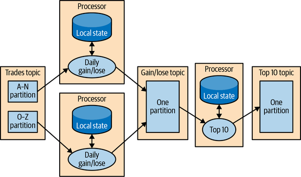

 

repartition은 강력하지만 비용이 있음

data를 내부 topic에 다시 쓰고 다시 읽어야 하므로 network, disk, broker 부하가 생김

따라서 key 변경이 필요한 지점을 명확히 이해하고 topology를 설계해야 함

 

### Stream-Table Join

stream processing에서는 event를 다른 정보와 결합해야 하는 경우가 많음

예를 들어 click event에 user profile 정보를 붙이면 분석과 개인화가 쉬워짐

 

단순한 방식은 event마다 외부 database를 조회하는 것

하지만 이 방식은 latency가 커지고, 외부 database가 stream 처리량을 감당하지 못할 수 있음

 

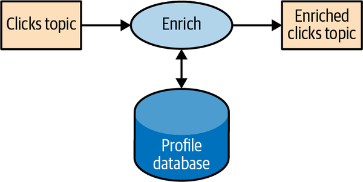

 

더 좋은 방식은 database 변경을 CDC로 Kafka topic에 넣고, Kafka Streams가 그 변경 stream을 local `KTable`로 materialize하는 것

그 다음 click `KStream`과 profile `KTable`을 join하면 매 event마다 외부 database를 직접 조회하지 않아도 됨

 

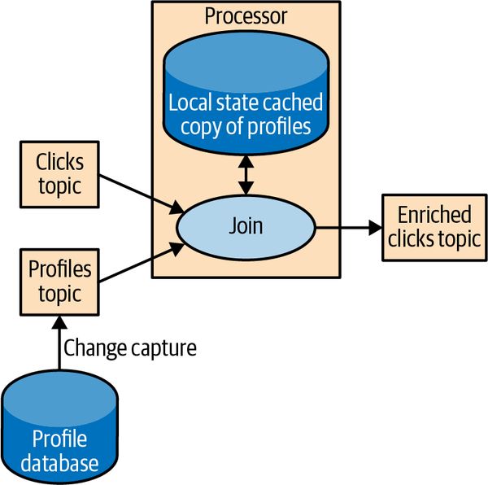

 

stream-table join은 현재 상태를 조회하는 join에 적합함

event stream은 계속 들어오고, table은 key별 최신 상태를 제공함

 

### Table-Table Join

table-table join은 두 table의 현재 상태를 join하는 방식

두 table 모두 변경 stream에서 만들어진 materialized view로 볼 수 있음

 

Kafka Streams는 같은 key로 partition된 table 간 join을 효율적으로 분산할 수 있음

또한 최신 Kafka Streams 계열에서는 foreign-key join도 지원하지만, 실제 사용 가능 여부와 제약은 배포 version의 공식 문서를 확인해야 함

 

### Streaming Join

stream-stream join은 두 event stream의 history를 window 안에서 맞추는 작업

table join처럼 현재 상태만 보면 되는 것이 아니라, 양쪽 stream의 event가 같은 key와 가까운 event time 안에서 발생했는지 봐야 함

 

예:
- 검색 event와 클릭 event를 join
- 주문 event와 결제 event를 join
- 센서 event와 알림 event를 join

 

stream-stream join은 windowed join이므로 state store가 필요함

양쪽 stream에서 join 가능성이 있는 event를 window 동안 보관해야 하기 때문

 

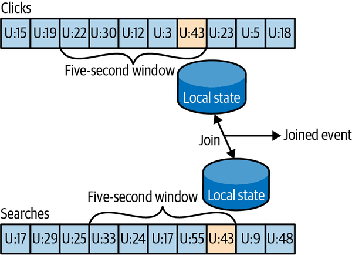

 

join 대상 topic은 key 기준 partitioning과 partition 수가 맞아야 안정적으로 처리할 수 있음

key 설계가 잘못되면 join이 깨지거나 repartition 비용이 커짐

 

### Out-of-Sequence Events

실제 운영에서는 event가 발생한 순서대로 도착하지 않음

mobile device가 offline 상태였다가 나중에 event를 몰아서 보내거나, network 장애 이후 과거 event가 늦게 들어올 수 있음

 

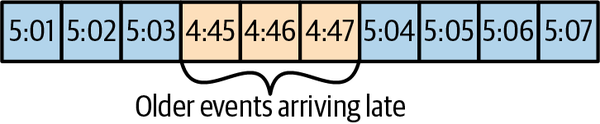

 

late event를 다루려면 다음을 정해야 함:
- event time을 어떻게 읽을지
- 어느 정도 늦은 event까지 받아들일지
- 늦은 event가 기존 window 결과를 바꿀 수 있는지
- 결과 topic이나 외부 sink가 update를 허용하는지

 

Kafka Streams는 event time과 window grace period를 통해 late event를 처리할 수 있음

aggregation 결과는 보통 key별 최신 값을 compacted topic에 쓰므로, 늦은 event로 결과가 바뀌면 새 결과를 다시 쓸 수 있음

 

### Reprocessing

Kafka는 event log를 장기간 보관할 수 있으므로 stream processing application을 다시 실행해 과거 event를 재처리할 수 있음

reprocessing은 크게 두 가지 상황에서 필요함

 

상황:
- 새 version의 application을 같은 input topic에 대해 실행해 결과를 비교
- 기존 application bug를 고친 뒤 과거 data부터 다시 계산

 

가능하면 새 `application.id`와 새 output topic을 사용해 새 version을 병렬로 실행하는 방식이 안전함

기존 application의 state와 output을 직접 reset하는 방식은 cleanup 범위가 넓고 실수 비용이 큼

 

Kafka Streams에는 application reset 도구가 있지만, 운영에서는 이전 결과와 새 결과를 비교할 수 있는 병렬 실행 방식이 더 실용적인 경우가 많음

 

### Interactive Queries

Kafka Streams application의 state store는 application 내부에 분산되어 있음

대부분의 결과는 output topic으로 읽지만, 어떤 경우에는 state store를 직접 조회하고 싶을 수 있음

이 기능이 Interactive Queries임

 

예:
- 실시간 top N table 조회
- 특정 user의 최신 profile 조회
- window aggregation의 현재 결과 조회
- materialized view를 API로 제공

 

주의할 점은 state가 여러 instance에 나뉘어 있다는 것

조회 API를 만들려면 key가 어느 instance에 있는지 찾아 routing하거나, 모든 instance를 조회하는 구조가 필요함

 

### Kafka Streams 기본 구성

Kafka Streams application은 일반 Java application으로 실행됨

핵심 설정은 `application.id`와 `bootstrap.servers`

 

`application.id`는 Kafka Streams application을 식별함

consumer group id, internal topic prefix, state directory와 관련되므로 운영 중 함부로 바꾸면 다른 application처럼 동작함

 

`bootstrap.servers`는 연결할 Kafka broker 주소

producer/consumer client와 마찬가지로 cluster 접속 정보를 제공함

 

보통 함께 설정하는 항목:
- key/value Serde
- `processing.guarantee`
- state directory
- num stream threads
- replication factor for internal topics
- commit interval
- topology optimization

 

### Word Count Example

Kafka Streams의 기본 예제는 word count

input topic에서 문장을 읽고, 단어로 나누고, 단어별 count를 계산한 뒤 output topic에 씀

 

흐름:
- `StreamsBuilder` 생성
- input topic을 `KStream`으로 읽음
- line을 word로 분해
- word 기준으로 grouping
- count로 `KTable` 생성
- `KTable`을 stream으로 바꿔 output topic에 기록

 

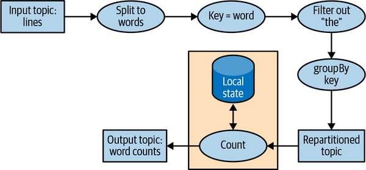

 

이 예제는 작지만 Kafka Streams의 핵심 흐름을 보여줌

`KStream`은 event stream이고, count 결과는 key별 최신 상태인 `KTable`

 

### Stock Market Statistics Example

주식 거래 통계 예제는 window와 custom aggregation을 보여줌

symbol별로 window를 만들고, 각 window 안에서 거래 수, 최소값, 최대값, 평균 같은 통계를 계산함

 

핵심 요소:
- event time 기준 timestamp
- `TimeWindows`
- `Windowed` key
- state store materialization
- windowed Serde

 

window aggregation은 state store와 changelog topic을 동반함

따라서 단순 map/filter보다 운영 비용과 복구 시간을 더 신중하게 봐야 함

 

### ClickStream Enrichment Example

clickstream enrichment 예제는 stream-table join과 stream-stream join을 함께 보여줌

page view stream, search stream, user profile table을 읽고 user activity stream을 만듦

 

구성:
- page view는 `KStream`
- search event도 `KStream`
- user profile은 `KTable`
- page view와 profile은 stream-table join
- page view와 search는 windowed stream-stream join

 

이 예제에서 중요한 점은 enrichment를 외부 database lookup으로 처리하지 않는다는 것

profile 변경을 Kafka로 가져와 local table로 만들고, stream 처리 경로 안에서 join함

 

### Building a Topology

Kafka Streams application은 먼저 DSL로 logical topology를 정의함

`KStream`, `KTable` 객체를 만들고 filter, map, groupBy, join, aggregate 같은 operation을 연결함

 

이후 `StreamsBuilder.build()`가 physical topology를 만들고, `KafkaStreams.start()`가 실행을 시작함

logical topology를 작성한 코드와 실제 실행 topology가 완전히 같은 것은 아님

repartition, state store, changelog topic 같은 내부 구조가 추가될 수 있음

 

### Optimizing a Topology

Kafka Streams는 topology optimization을 일부 지원함

예를 들어 불필요한 internal topic 생성을 줄이거나 재사용할 수 있음

 

하지만 optimization은 결과가 같아야 의미가 있음

운영에 적용하기 전에는 optimization 전후로 처리 결과, Kafka에 쓰는 data 양, 처리량, latency를 비교해야 함

 

### Testing a Topology

Kafka Streams topology는 `TopologyTestDriver`로 빠르게 테스트할 수 있음

실제 Kafka cluster 없이 input topic에 record를 넣고, topology를 실행한 뒤 output topic 결과를 검증하는 방식

 

테스트에서 확인할 것:
- transform 결과
- aggregation 결과
- join 결과
- timestamp와 window 처리
- Serde 설정
- late event 처리

 

`TopologyTestDriver`는 빠르지만 실제 broker, rebalance, caching, network, internal topic 동작을 모두 재현하지는 않음

중요한 application은 integration test도 함께 두는 것이 좋음

 

### Scaling a Topology

Kafka Streams의 병렬 처리 단위는 task

task 수는 input topic partition 수와 topology 구조에 의해 결정됨

각 task는 자신에게 할당된 partition을 읽고, 필요한 processor를 순서대로 실행하고, local state를 유지함

 

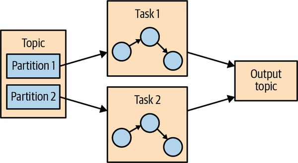

 

application instance 하나에 여러 stream thread를 둘 수 있고, 여러 server에서 같은 application을 실행할 수도 있음

Kafka Streams는 consumer group coordination을 사용해 task를 thread와 instance에 분배함

 

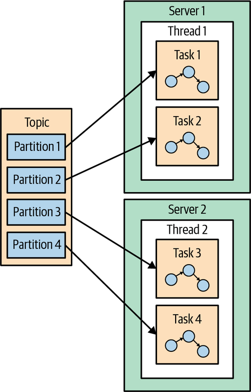

 

확장할 때 기본 원칙:
- 처리량이 부족하면 thread나 instance를 늘림
- partition 수보다 많은 task 병렬성은 만들 수 없음
- stateful topology는 state 복구 비용도 함께 증가함
- join 대상 topic은 partition 수와 key partitioning을 맞춰야 함

 

repartition이 필요한 topology는 subtopology로 나뉨

첫 번째 task set이 repartition topic에 쓰고, 두 번째 task set이 그 topic을 읽어 다음 처리를 수행함

 

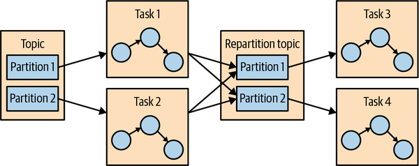

 

### Surviving Failures

Kafka Streams는 Kafka의 consumer coordination과 changelog topic을 사용해 장애를 복구함

thread나 instance가 죽으면 해당 task는 살아 있는 다른 thread나 instance로 재할당됨

 

stateless task는 offset부터 다시 읽으면 되므로 복구가 단순함

stateful task는 local state store를 복구해야 하므로 changelog topic을 다시 읽는 시간이 필요함

 

복구 시간을 줄이는 방법:
- changelog topic compaction 설정 확인
- state store 크기 관리
- standby replica 사용
- state directory disk 성능 확보
- cooperative rebalancing과 static membership 활용 가능 여부 확인

 

standby replica는 active task의 state를 다른 instance에서 미리 따라가게 하는 방식

장애 시 이미 warm-up된 state를 가진 standby가 active로 전환될 수 있어 복구 시간을 줄일 수 있음

 

### Stream Processing Use Cases

Kafka Streams가 잘 맞는 use case:
- event-driven microservices
- real-time ETL
- stream enrichment
- fraud detection
- alerting
- IoT event processing
- clickstream analysis
- materialized view 생성
- CDC 기반 data 동기화
- real-time aggregation

 

Kafka Streams는 Kafka topic을 중심으로 동작하는 application에 특히 잘 맞음

별도 processing cluster를 운영하지 않고 application deployment model을 유지할 수 있다는 점이 장점

 

### Stream Processing Framework 선택 기준

framework를 고를 때는 feature 목록보다 운영 조건을 먼저 봐야 함

stream processing은 한번 운영에 들어가면 state, topic, offset, output consumer까지 엮이므로 교체 비용이 큼

 

확인할 기준:
- event time과 late event 처리
- window와 join 지원
- state store와 recovery 방식
- exactly-once 지원 범위
- Kafka와의 integration 수준
- scaling model
- deployment model
- testing support
- monitoring과 운영 도구
- team이 익숙한 language와 runtime

 

Kafka Streams는 Kafka 중심 architecture와 Java ecosystem에 잘 맞음

반대로 여러 source/sink와 대규모 cluster scheduler, SQL 중심 처리가 더 중요하다면 Flink, Spark, ksqlDB 같은 다른 선택지도 비교해야 함

 

### 운영 관점 체크 포인트

stream processing application을 운영할 때는 code만 보면 부족함

topology가 만드는 internal topic, local state, changelog, repartition, consumer group까지 함께 봐야 함

 

체크할 것:
- `application.id`를 stable하게 유지하는가
- input topic partition 수가 필요한 병렬성을 제공하는가
- repartition topic이 예상보다 많이 생기지 않았는가
- state store 크기가 disk에 맞는가
- changelog topic replication factor가 충분한가
- compaction 설정이 state 복구에 적합한가
- late event와 grace period 정책이 업무 요구와 맞는가
- output topic이 update semantics를 감당하는가
- topology test와 integration test가 있는가
- 배포 version의 Kafka Streams 설정 값을 공식 문서로 확인했는가

 

### Summary

stream processing은 끝없는 event stream을 계속 처리하는 방식

Kafka Streams는 Kafka topic, partition, consumer group, transaction, changelog topic을 활용해 stream processing을 application library 형태로 제공함

 

핵심은 topology, time, state, window, join, processing guarantee를 정확히 이해하는 것

특히 stateful processing은 local state store와 changelog topic, repartition topic, recovery time까지 운영 관점에서 함께 설계해야 함

 

Kafka Streams는 단순 map/filter부터 window aggregation, stream-table join, stream-stream join, interactive queries까지 지원함

하지만 실제 운영에서는 topology가 만드는 내부 topic과 state를 반드시 확인해야 함

 

stream processing은 code의 문제가 아니라 data model, time semantics, state recovery, 운영 정책이 함께 맞아야 안정적으로 동작함
